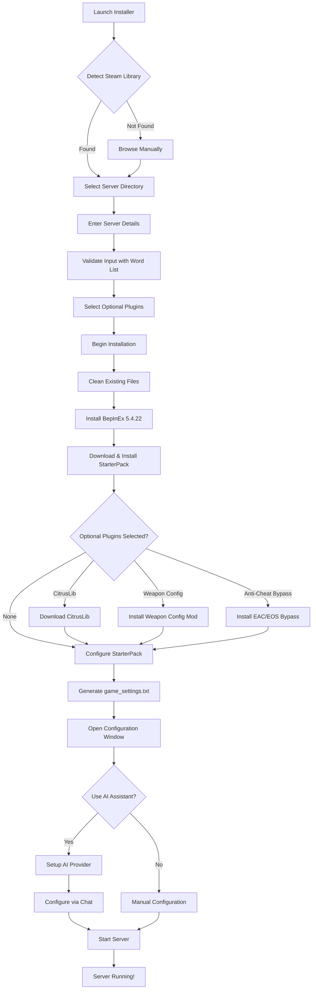

<pre>
 _____                                                               _____ 
( ___ )-------------------------------------------------------------( ___ )
 |   |                                                               |   | 
 |   |  _____  _    ____   ____      ____                            |   | 
 |   | |_   _|/ \  | __ ) / ___|    / ___|  ___ _ ____   _____ _ __  |   | 
 |   |   | | / _ \ |  _ \| |  _     \___ \ / _ \ '__\ \ / / _ \ '__| |   | 
 |   |   | |/ ___ \| |_) | |_| |     ___) |  __/ |   \ V /  __/ |    |   | 
 |   |  _|_/_/   \_\____/ \____| _  |____/ \___|_|    \_/ \___|_|    |   | 
 |   |                                                               |   | 
  |   |           T A B G   S E R V E R   I N S T A L L E R           |   |  
 |___|                                                               |___| 
(_____)-------------------------------------------------------------(_____) 
</pre>

*An installer, mod‑loader, and AI-powered configuration assistant for **Totally Accurate Battlegrounds** dedicated servers.*

---

## 🚀 Quick Start

### Option 1: Standard Installation

1. Download the latest **`TabgInstaller.zip`** from the [releases page](../../releases)
2. Extract and run **`TabgInstaller.exe`**
3. The installer will auto-detect your Steam library or you can browse manually
4. Enter your server details and select optional plugins
5. Click **Install** and wait for the process to complete
6. Configure your server using the visual editors or with the Ai 
7. Start your server from the console window

## AI Configuration Assistant

The installer includes an AI assistant that understands TABG configuration syntax and can modify your server settings through conversation.

### Supported Providers
- **OpenAI** (GPT-4, o3, ...)
- **Anthropic** (Claude 4, ...)
- **Google** (Gemini)
- **xAI** (Grok)
- **Local AI** (Free via Ollama with DeepSeek-R1, Qwen 2.5, Llama 3.2, etc.)

## Project Structure

| Project                             | Type            | Description                                                              |
| ----------------------------------- | --------------- | ------------------------------------------------------------------------ |
| **TabgInstaller.Core**              | Library         | Core installation logic, GitHub API, configuration management            |
| **TabgInstaller.Gui**               | WPF App         | Main installer UI with tabs for settings, presets, and AI chat          |
| **TabgInstaller.AntiCheatBypass**   | BepInEx Plugin  | Harmony patches to bypass EAC/EOS for dedicated servers                 |
| **TabgInstaller.WeaponSpawnConfig** | BepInEx Plugin  | Runtime weapon spawn rate configuration                                  |
| **TabgInstaller.StarterPack**       | BepInEx Plugin  | Essential server modifications (respawning, lobbies, etc.)              |
| **TabgInstaller.TestMod**           | BepInEx Plugin  | Example mod for developers                                               |
| **ConfigSanitizer**                 | Console App     | Fixes malformed JSON in configuration files                             |

---

## 📊 Installation Flow

## 🔧 Requirements

- Windows 10/11 (64-bit)
- .NET Framework 4.7.2 or higher
- Steam with TABG Dedicated Server installed
- (Optional) API key for AI features or ~4GB disk space for local AI

---

## 🙏 Credits

- **Landfall Games** - For creating TABG
- **BepInEx Team** - For the modding framework
- **CyrusTheLesser** - For CitrusLib
- **ContagiouslyStupid** - For the StarterPack

## 📄 License

Released under the **MIT License** – see [LICENSE](LICENSE) for the full text.
