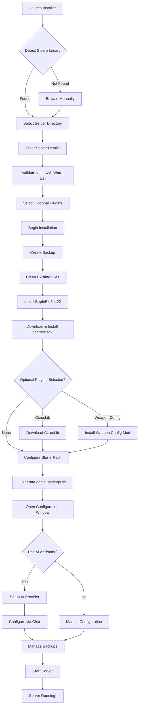

<pre>
 _____                                                               _____ 
( ___ )-------------------------------------------------------------( ___ )
 |   |                                                               |   | 
 |   |  _____  _    ____   ____      ____                            |   | 
 |   | |_   _|/ \  | __ ) / ___|    / ___|  ___ _ ____   _____ _ __  |   | 
 |   |   | | / _ \ |  _ \| |  _     \___ \ / _ \ '__\ \ / / _ \ '__| |   | 
 |   |   | |/ ___ \| |_) | |_| |     ___) |  __/ |   \ V /  __/ |    |   | 
 |   |  _|_/_/   \_\____/ \____| _  |____/ \___|_|    \_/ \___|_|    |   | 
 |   |                                                               |   | 
  |   |           T A B G   S E R V E R   I N S T A L L E R           |   |  
 |___|                                                               |___| 
(_____)-------------------------------------------------------------(_____) 
</pre>

*An installer, mod‑loader, AI-powered configuration assistant, and backup manager for **Totally Accurate Battlegrounds** dedicated servers.*

---

## ✨ Key Features

### 🤖 AI Configuration Assistant
- **Real-time streaming** - See AI responses token-by-token as they type
- **Reasoning display** - Watch Claude's thinking process with extended thinking streams
- **Smart fallbacks** - Automatic graceful degradation for unverified OpenAI organizations
- **Tool calling** - AI can directly edit `game_settings.txt` and `TheStarterPack.txt`
- **Knowledge integration** - AI has access to weapon lists and configuration explanations

### 🛡️ Backup System
- **Automatic backups** - Created before every installation in protected `backup/` folder
- **Simple management** - View, restore, and delete backups with dates and sizes
- **Protected storage** - Backup folder is added to vanilla files whitelist
- **Manual backups** - Create backups anytime outside installation process

### 📱 Four-Tab Interface
1. **Installer** - Server installation with backup warnings
2. **Config** - Visual configuration editor
3. **AI Chat** - Streaming AI assistant with animated thinking indicator
4. **Backups** - Backup management with minimal styling

### Supported AI Providers
- **OpenAI** (GPT-5 thinking models with reasoning display)
- **Anthropic** (Claude with extended thinking streams)
- **xAI** (Grok-4 with streaming support)
- **Google Gemini** (Vertex AI with streaming)

---

## 📊 Installation Flow

## 🔧 Requirements

- **Windows 10/11** (64-bit)
- **.NET 8.0 Runtime** (automatically installed if missing)
- **Steam** with TABG Dedicated Server installed
- **(Optional)** API key for AI features (OpenAI, Anthropic, xAI, Google)

## 📋 Recent Updates

### v2.0.0 - AI Streaming & Backup System
- **🚀 Real-time streaming** - Token-by-token AI responses with typing effect
- **🧠 Reasoning display** - Watch Claude's thinking process live
- **🛡️ Backup system** - Automatic backups before installation with management UI
- **🎨 Enhanced UX** - Animated thinking indicator, fallback handling, minimal styling
- **⚡ Performance** - Improved tool call parsing and loadout display
- **🔒 Security** - Protected backup storage and graceful error handling

### Previous Features
- Multi-provider AI support (OpenAI, Anthropic, xAI, Google)
- Visual configuration editor with dynamic UI generation
- Tool calling for direct config file modification
- Secure API key storage with Windows DPAPI
- Automatic server validation and mod installation

---

## 🙏 Credits

- **Landfall Games** - For creating TABG
- **BepInEx Team** - For the modding framework
- **CyrusTheLesser** - For CitrusLib
- **ContagiouslyStupid** - For the StarterPack

## 📄 License

Released under the **MIT License** – see [LICENSE](LICENSE) for the full text.
