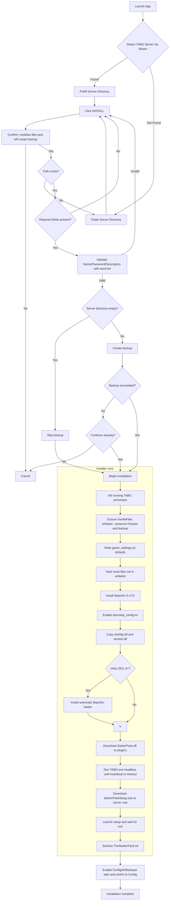

<div align="center">

<pre>
 _____                                                               _____ 
( ___ )-------------------------------------------------------------( ___ )
 |   |                                                               |   | 
 |   |  _____  _    ____   ____      ____                            |   | 
 |   | |_   _|/ \  | __ ) / ___|    / ___|  ___ _ ____   _____ _ __  |   | 
 |   |   | | / _ \ |  _ \| |  _     \___ \ / _ \ '__\ \ / / _ \ '__| |   | 
 |   |   | |/ ___ \| |_) | |_| |     ___) |  __/ |   \ V /  __/ |    |   | 
 |   |  _|_/_/   \_\____/ \____| _  |____/ \___|_|    \_/ \___|_|    |   | 
 |   |                                                               |   | 
  |   |           T A B G   S E R V E R   I N S T A L L E R           |   |  
 |___|                                                               |___| 
(_____)-------------------------------------------------------------(_____) 
</pre>

</div>


## Installation Flow




## Requirements

- **Windows 10/11** (64-bit)
- **.NET 8.0 Desktop Runtime** (only if using the framework-dependent build in `publish/`)
- **Steam** with TABG Dedicated Server installed
- **(Optional)** API key or access token for AI features (OpenAI, Anthropic, xAI, Google Vertex)

---


## 🙏 Credits

- **Landfall Games** - For creating TABG
- **BepInEx Team** - For the modding framework
- **CyrusTheLesser** - For CitrusLib
- **ContagiouslyStupid** - For the StarterPack


## 📄 License

Released under the **MIT License** – see [LICENSE](LICENSE) for the full text.

---


## Key Storage and Knowledge Files

- Keys are stored per provider at `%LOCALAPPDATA%\TABGInstaller\keys`, encrypted via Windows DPAPI (Current User)
- The AI uses the `Knowledge` folder next to `TabgInstaller.Gui.exe` (`Game settings explanation.json`, `The starter pack explained.json`, `Weaponlist.json`)

## 🧰 Tool Calling (advanced)

The assistant can request config edits by emitting a line starting with `TOOL_CALL` followed by JSON:

```json
TOOL_CALL {"tool":"edit_tabg_config","target":"game_settings|starter_pack","ops":[{"type":"set","key":"KeyName","value":"NewValue"}]}
```

- `game_settings` -> `game_settings.txt`
- `starter_pack` -> `TheStarterPack.txt`
- Keys use `Key=Value` format; unknown keys are appended

Example:

```json
TOOL_CALL {"tool":"edit_tabg_config","target":"game_settings","ops":[{"type":"set","key":"MaxPlayers","value":"70"}]}
```


