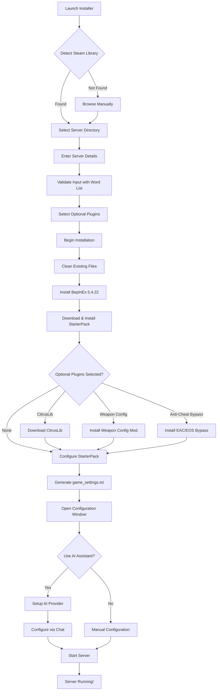

<div align="center">

<pre>
 _____                                                               _____ 
( ___ )-------------------------------------------------------------( ___ )
 |   |                                                               |   | 
 |   |  _____  _    ____   ____      ____                            |   | 
 |   | |_   _|/ \  | __ ) / ___|    / ___|  ___ _ ____   _____ _ __  |   | 
 |   |   | | / _ \ |  _ \| |  _     \___ \ / _ \ '__\ \ / / _ \ '__| |   | 
 |   |   | |/ ___ \| |_) | |_| |     ___) |  __/ |   \ V /  __/ |    |   | 
 |   |  _|_/_/   \_\____/ \____| _  |____/ \___|_|    \_/ \___|_|    |   | 
 |   |                                                               |   | 
  |   |           T A B G   S E R V E R   I N S T A L L E R           |   |  
 |___|                                                               |___| 
(_____)-------------------------------------------------------------(_____) 
</pre>

</div>

*An advanced installer, mod‑loader, and AI-powered configuration assistant for **Totally Accurate Battlegrounds** dedicated servers.*

---

## ✨ Key Features

- **🤖 AI Configuration Assistant** - Natural language server configuration with support for OpenAI, Anthropic, Google, xAI, or free local AI via Ollama
- **🔧 One-Click Installation** - Automatically sets up BepInEx, StarterPack, and optional mods
- **📊 Advanced Configuration UI** - Visual editors for all server settings with live validation
- **🎮 Weapon Spawn Control** - Fine-tune spawn rates for every weapon, item, and blessing
- **💾 Preset Management** - Save and load configuration presets for different game modes
- **🛡️ Anti-Cheat Bypass** - Built-in EAC/EOS bypass for dedicated servers
- **📦 Mod Support** - Easy plugin installation with CitrusLib integration

---

## 🚀 Quick Start

### Option 1: Standard Installation

1. Download the latest **`TabgInstaller.Gui.zip`** from the [releases page](../../releases)
2. Extract and run **`TabgInstaller.exe`**
3. The installer will auto-detect your Steam library or you can browse manually
4. Enter your server details and select optional plugins
5. Click **Install** and wait for the process to complete
6. Configure your server using the visual editors
7. Start your server from the console window

### Option 2: With AI Assistant

1. Run the bootstrap script first:
   ```powershell
   .\bootstrap.ps1
   ```
2. Follow the standard installation steps above
3. Click **AI Chat** in the configuration window to use natural language commands

---

## 🤖 AI Configuration Assistant

The installer includes an AI assistant that understands TABG configuration syntax and can modify your server settings through conversation.

### Supported Providers
- **OpenAI** (GPT-4, o3)
- **Anthropic** (Claude 4)
- **Google** (Gemini)
- **xAI** (Grok)
- **Local AI** (Free via Ollama with DeepSeek-R1, Qwen 2.5, Llama 3.2, etc.)

### Example Commands
- "Set the server name to 'Epic TABG Server' and max players to 100"
- "Enable team mode with 4-player squads"
- "Configure a sniper-only game mode"
- "Disable all blessings and increase legendary weapon spawns"

[Full AI documentation →](AI_CHAT_README.md)

---

## 🎯 Weapon Spawn Configuration

Fine-tune the spawn rates of all weapons, items, and blessings with the integrated spawn config mod.

### Features
- Individual weapon multipliers (0.0 - 10.0)
- Category-based multipliers (e.g., all SMGs, all Snipers)
- Global spawn rate control
- Quick presets: Weapons Only, Melee Madness, Sniper Paradise, etc.
- Visual GUI for easy configuration

[Weapon Config documentation →](TabgInstaller.WeaponSpawnConfig/README.md)

---

## 🛠️ Advanced Features

### Server Configuration
- **Dynamic Settings Editor** - All game_settings.txt parameters with descriptions
- **Validation** - Real-time validation using TABG's official word list
- **Hot Reload** - Apply changes without restarting
- **Backup/Restore** - Automatic configuration backups

### Mod Management
- **CitrusLib Integration** - Essential modding framework
- **Plugin Browser** - Easy installation of community mods
- **Version Management** - Automatic updates for installed mods
- **Compatibility Checking** - Ensures mod compatibility

---

## 📁 Project Structure

| Project                             | Type            | Description                                                              |
| ----------------------------------- | --------------- | ------------------------------------------------------------------------ |
| **TabgInstaller.Core**              | Library         | Core installation logic, GitHub API, configuration management            |
| **TabgInstaller.Gui**               | WPF App         | Main installer UI with tabs for settings, presets, and AI chat          |
| **TabgInstaller.AntiCheatBypass**   | BepInEx Plugin  | Harmony patches to bypass EAC/EOS for dedicated servers                 |
| **TabgInstaller.WeaponSpawnConfig** | BepInEx Plugin  | Runtime weapon spawn rate configuration                                  |
| **TabgInstaller.StarterPack**       | BepInEx Plugin  | Essential server modifications (respawning, lobbies, etc.)              |
| **TabgInstaller.TestMod**           | BepInEx Plugin  | Example mod for developers                                               |
| **ConfigSanitizer**                 | Console App     | Fixes malformed JSON in configuration files                             |

---

## 📊 Installation Flow



---

## 💻 Command Line Usage

For automated deployments or CI/CD pipelines:

```powershell
dotnet TabgInstaller.Core.dll \
  --steamDir "D:\SteamLibrary" \
  --serverDir "D:\SteamLibrary\steamapps\common\TotallyAccurateBattlegroundsDedicatedServer" \
  --serverName "My TABG Server" \
  --serverPassword "secret123" \
  --serverDescription "Epic battles await!" \
  --citrusTag v3.2.0 \
  --installCommunityServer true \
  --skipAntiCheatBypass false \
  --installWeaponConfig true
```

---

## 🔧 Requirements

- Windows 10/11 (64-bit)
- .NET Framework 4.7.2 or higher
- Steam with TABG Dedicated Server installed
- (Optional) API key for AI features or ~4GB disk space for local AI

---

## 🤝 Contributing

Contributions are welcome! Please check out our [contributing guidelines](CONTRIBUTING.md) and feel free to submit pull requests.

### Development Setup
1. Clone the repository
2. Open `TabgInstaller.sln` in Visual Studio 2022
3. Restore NuGet packages
4. Build the solution

---

## 📚 Documentation

- [AI Chat Feature Guide](AI_CHAT_README.md)
- [Weapon Configuration Guide](TabgInstaller.WeaponSpawnConfig/README.md)
- [StarterPack Configuration](docs/starter-pack.md)
- [Troubleshooting](docs/troubleshooting.md)

---

## 🙏 Credits

- **Landfall Games** - For creating TABG
- **BepInEx Team** - For the modding framework
- **CyrusTheLesser** - For CitrusLib
- **ContagiouslyStupid** - For the original StarterPack
- All contributors and the TABG modding community

---

## 📄 License

Released under the **MIT License** – see [LICENSE](LICENSE) for the full text.
