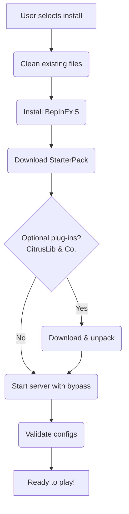

# 🛠️ TABG Dedicated Server Toolkit

*A zero‑friction installer & mod‑loader for **Totally Accurate Battlegrounds** dedicated servers.*


> **A fresh TABG server from scratch—in under one minute.**

---

## ✨ Features

* **One‑click install** – wizard detects your Steam library & sets everything up automatically.
* **BepInEx 5 built‑in** – modern Unity mod loader configured out of the box.
* **StarterPack autoconfig** – downloads the latest release and walks you through its GUI.
* **Community plug‑ins** – optional grab‑and‑go install for *CitrusLib*, *TABGCommunityServer*, and more.
* **Anti‑cheat bypass** – safely disables EAC/EOS on headless servers so mods can load.
* **Self‑healing** – cleans stale files, validates UTF‑8 configs with `ConfigSanitizer`, and keeps everything tidy.

---

## 🚀 Quick start

### Graphical wizard

1. Download the latest **`TabgInstaller.Gui.zip`** from the [releases page](../../releases).
2. Unzip and double‑click **`TabgInstaller.exe`**.
3. Confirm the detected Steam library path or browse manually.
4. Pick a server name, select optional plug‑ins, and press **Install**.
5. Grab a coffee—by the time you’re back, your modded TABG server is live! ☕️

### Headless / CI

```powershell
dotnet TabgInstaller.Core.dll `
  --steamDir "D:\SteamLibrary" `
  --serverDir "D:\SteamLibrary\steamapps\common\TotallyAccurateBattlegroundsDedicatedServer" `
  --citrusTag v3.2.0 `
  --installCommunityServer true `
  --skipAntiCheatBypass false
```

---

## 🗂️ Project layout

| Project                             | Type            | Description                                                 |
| ----------------------------------- | --------------- | ----------------------------------------------------------- |
| **ConfigSanitizer**                 | Console         | Fixes bad JSON in *TheStarterPack.json*.                    |
| **TabgInstaller.Core**              | Library         | Handles discovery, download, install & diagnostics.         |
| **TabgInstaller.Gui**               | WPF             | Friendly wizard front‑end with live logs.                   |
| **TabgInstaller.AntiCheatBypass**   | BepInEx plug‑in | Harmony patch that short‑circuits EAC/EOS initialisation.   |
| **TabgInstaller.WeaponSpawnConfig** | BepInEx plug‑in | Runtime loot‑table multiplier (global → category → weapon). |
| **examples/**                       | Samples         | Hello‑world mods & config‑API demos.                        |

---

## 🛠️ Under the hood



---

## 📄 License

Released under the **MIT License** – see [LICENSE](LICENSE) for the full text.
