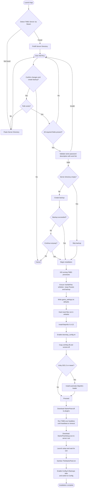

<div align="center">

<pre>
 _____                                                               _____ 
( ___ )-------------------------------------------------------------( ___ )
 |   |                                                               |   | 
 |   |  _____  _    ____   ____      ____                            |   | 
 |   | |_   _|/ \  | __ ) / ___|    / ___|  ___ _ ____   _____ _ __  |   | 
 |   |   | | / _ \ |  _ \| |  _     \___ \ / _ \ '__\ \ / / _ \ '__| |   | 
 |   |   | |/ ___ \| |_) | |_| |     ___) |  __/ |   \ V /  __/ |    |   | 
 |   |  _|_/_/   \_\____/ \____| _  |____/ \___|_|    \_/ \___|_|    |   | 
 |   |                                                               |   | 
  |   |           T A B G   S E R V E R   I N S T A L L E R           |   |  
 |___|                                                               |___| 
(_____)-------------------------------------------------------------(_____) 
</pre>

</div>

### Disclaimer 

> **Important:**
> This installer downloads and instals configures the **StarterPack** created by **ContagiouslyStupid**. I did not write or maintain the StarterPack code. https://github.com/ContagiouslyStupid/TABGStarterPack

>also at the moment the ai chat is buggy and might not work right


## Installation Flow


---

## Requirements

### Essentials (required)

* Windows 10/11, 64-bit
* Steam with **TABG Dedicated Server** installed

### Runtime options (choose one)

* **Self-contained build** — no .NET installation required
* **Framework-dependent build** — install **.NET 8.0 Desktop Runtime**
  *(applies only if you use the framework-dependent build in `publish/`)*

### Optional (for AI features)

* API key or access token for any of: OpenAI, Anthropic, xAI, Google Vertex

---

## Credits

* **ContagiouslyStupid** — StarterPack )
* **Landfall Games** — Totally Accurate Battlegrounds (TABG)
* **BepInEx Team** — modding framework
* **CyrusTheLesser** — CitrusLib

---

## Key Storage and Knowledge Files

### Key storage

* Location:

  ```
  %LOCALAPPDATA%\TABGInstaller\keys
  ```
* Per-provider key files
* Encrypted with **Windows DPAPI (Current User)**

### Knowledge files

* Directory: `Knowledge` (next to `TabgInstaller.Gui.exe`)
* Used by the assistant:

  * `Game settings explanation.json`
  * `The starter pack explained.json`
  * `Weaponlist.json`

---

## Tool Calling (advanced)

The assistant can request config edits by outputting a single line that begins with `TOOL_CALL` followed by JSON.

**Format**

```text
TOOL_CALL {"tool":"edit_tabg_config","target":"game_settings|starter_pack","ops":[{"type":"set","key":"KeyName","value":"NewValue"}]}
```

**Targets**

* `game_settings` → edits `game_settings.txt`
* `starter_pack` → edits `TheStarterPack.txt`

**Conventions**

* Keys follow `Key=Value`
* Unknown keys are appended if not present

**Examples**

Set maximum players:

```text
TOOL_CALL {"tool":"edit_tabg_config","target":"game_settings","ops":[{"type":"set","key":"MaxPlayers","value":"70"}]}
```

Set server name in StarterPack:

```text
TOOL_CALL {"tool":"edit_tabg_config","target":"starter_pack","ops":[{"type":"set","key":"ServerName","value":"My Cool Server"}]}
```

---

## License

Released under the **MIT License** — see [`LICENSE`](./LICENSE).

---

If you want any features added just send me a DM on Discord: anonymer__hase_22156

