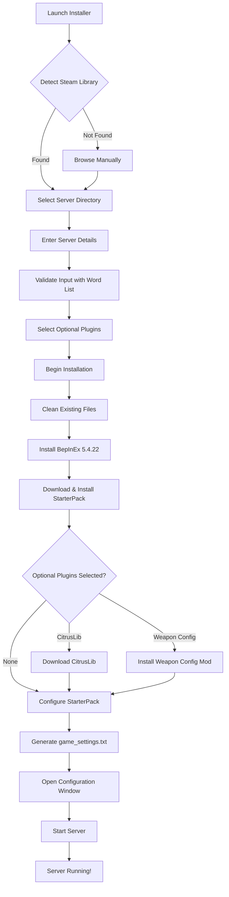

<pre>
 _____                                                               _____ 
( ___ )-------------------------------------------------------------( ___ )
 |   |                                                               |   | 
 |   |  _____  _    ____   ____      ____                            |   | 
 |   | |_   _|/ \  | __ ) / ___|    / ___|  ___ _ ____   _____ _ __  |   | 
 |   |   | | / _ \ |  _ \| |  _     \___ \ / _ \ '__\ \ / / _ \ '__| |   | 
 |   |   | |/ ___ \| |_) | |_| |     ___) |  __/ |   \ V /  __/ |    |   | 
 |   |  _|_/_/   \_\____/ \____| _  |____/ \___|_|    \_/ \___|_|    |   | 
 |   |                                                               |   | 
  |   |           T A B G   S E R V E R   I N S T A L L E R           |   |  
 |___|                                                               |___| 
(_____)-------------------------------------------------------------(_____) 
</pre>

*An installer and mod‑loader for **Totally Accurate Battlegrounds** dedicated servers.*

---
## Notes

- The installer preserves your `Presets/` folder on cleanup.
- You can click “Continue without install” to open the Config tab for an existing server without reinstalling.
- The legacy `START_SERVER_WITH_MODS.bat` launcher is removed.

## 📊 Installation Flow

## 🔧 Requirements

- Windows 10/11 (64-bit)
- .NET Framework 4.7.2 or higher
- Steam with TABG Dedicated Server installed

---

## 🙏 Credits

- **Landfall Games** - For creating TABG
- **BepInEx Team** - For the modding framework
- **CyrusTheLesser** - For CitrusLib
- **ContagiouslyStupid** - For the StarterPack

## 📄 License

Released under the **MIT License** – see [LICENSE](LICENSE) for the full text.
