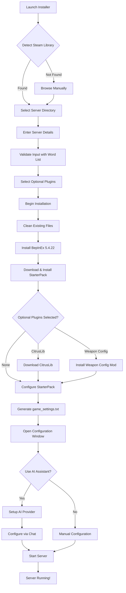

<pre>
 _____                                                               _____ 
( ___ )-------------------------------------------------------------( ___ )
 |   |                                                               |   | 
 |   |  _____  _    ____   ____      ____                            |   | 
 |   | |_   _|/ \  | __ ) / ___|    / ___|  ___ _ ____   _____ _ __  |   | 
 |   |   | | / _ \ |  _ \| |  _     \___ \ / _ \ '__\ \ / / _ \ '__| |   | 
 |   |   | |/ ___ \| |_) | |_| |     ___) |  __/ |   \ V /  __/ |    |   | 
 |   |  _|_/_/   \_\____/ \____| _  |____/ \___|_|    \_/ \___|_|    |   | 
 |   |                                                               |   | 
  |   |           T A B G   S E R V E R   I N S T A L L E R           |   |  
 |___|                                                               |___| 
(_____)-------------------------------------------------------------(_____) 
</pre>

*An installer, mod‑loader, and AI-powered configuration assistant for **Totally Accurate Battlegrounds** dedicated servers.*

---
## AI Configuration Assistant

The installer includes an AI assistant that understands TABG configuration syntax and can modify your server settings through conversation.

### What changed recently
- One-window app with three tabs: Installer, Config, AI Chat
- AI setup is prompted first. You can choose Local or Online providers
- Choose any provider/model from `models.json` (OpenAI, Anthropic, Google, xAI, etc.)
- Chat history with sync (AppData/TABGInstaller/Chats). Switch or create new chats from the header
- Messages can be edited and reloaded; copy button was removed
- “Online” indicator removed; plain status text shows Ready/Setup/Busy

### Supported Providers
- OpenAI (e.g. gpt-5, gpt-4o)
- Anthropic
- Google
- xAI
- Local AI (Ollama)
---

## 📊 Installation Flow

## 🔧 Requirements

- Windows 10/11 (64-bit)
- .NET Framework 4.7.2 or higher
- Steam with TABG Dedicated Server installed
- (Optional) API key for AI features or ~4GB disk space for local AI

---

## 🙏 Credits

- **Landfall Games** - For creating TABG
- **BepInEx Team** - For the modding framework
- **CyrusTheLesser** - For CitrusLib
- **ContagiouslyStupid** - For the StarterPack

## 📄 License

Released under the **MIT License** – see [LICENSE](LICENSE) for the full text.
